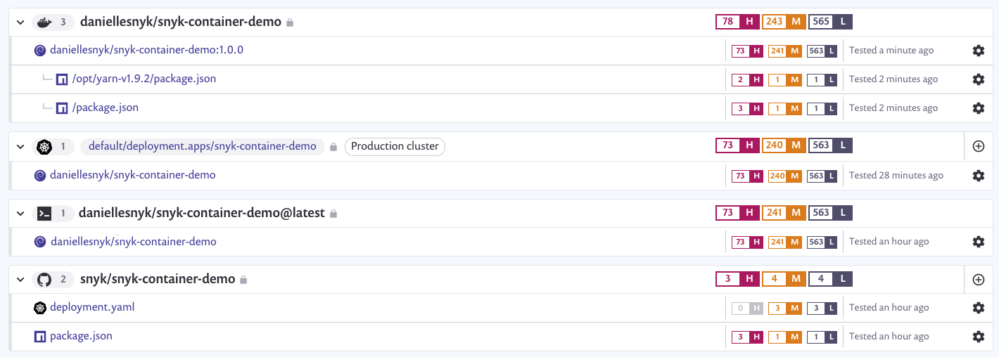
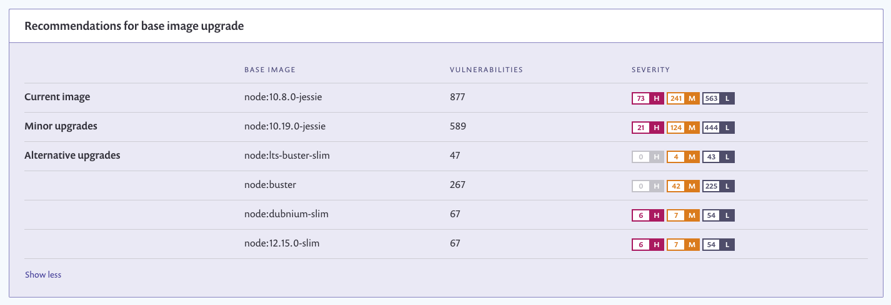

# Snyk Container Demo

This repository contains a hello world application which demonstrates the features of Snyk Container. In particular:

* Detecting vulnerabilites in operating system packages
* Detecting vulnerabilities from the application inside the container
* Recommending a more secure base image where one exists
* Detecting vulnerabilities in specific binary files installed outside the package manager
* Identifying where vulnerabilities have been introduced by the user vs the base image
* Revealing Kubernetes configuration issues that can result in an insecure application


## Snyk projects

Snyk supports a number of different integration options. Here we are showing all of them, including projects
imported from GitHub, Docker Hub, Kubernetes and the CLI. In normal usage you would probably choose specific
integrations that best fit your workflow.




## Base image recommendations

One of the most powerful features of Snyk Container is the ability to recommend a more secure base image.
In this particular we are using an old and insecure Node image and the recommendations can drastically cut down
on the number and severity of vulnerabilities.




## CLI

The simplest way of using Snyk is with out CLI. The basic usage of that is simply to point at an image and Snyk will
output information about it's vulnerabilties.

```console
$ snyk test --docker daniellesnyk/snyk-container-demo --file=Dockerfile
Testing daniellesnyk/snyk-container-demo:latest...

...

✗ Low severity vulnerability found in binutils
  Description: Allocation of Resources Without Limits or Throttling
  Info: https://snyk.io/vuln/SNYK-DEBIAN8-BINUTILS-404035
  Introduced through: dpkg/dpkg-dev@1.17.27, libtool@2.4.2-1.11
  From: dpkg/dpkg-dev@1.17.27 > binutils@2.25-5+deb8u1
  From: libtool@2.4.2-1.11 > gcc-defaults/gcc@4:4.9.2-2 > gcc-4.9@4.9.2-10+deb8u1 > binutils@2.25-5+deb8u1
  Introduced by your base image (node:10.8.0-jessie)

...

✗ Medium severity vulnerability found in binutils
  Description: Out-of-Bounds
  Info: https://snyk.io/vuln/SNYK-DEBIAN8-BINUTILS-403875
  Introduced through: dpkg/dpkg-dev@1.17.27, libtool@2.4.2-1.11
  From: dpkg/dpkg-dev@1.17.27 > binutils@2.25-5+deb8u1
  From: libtool@2.4.2-1.11 > gcc-defaults/gcc@4:4.9.2-2 > gcc-4.9@4.9.2-10+deb8u1 > binutils@2.25-5+deb8u1
  Introduced by your base image (node:10.8.0-jessie)


...

✗ High severity vulnerability found in apt/libapt-pkg4.12
  Description: Arbitrary Code Injection
  Info: https://snyk.io/vuln/SNYK-DEBIAN8-APT-407401
  Introduced through: apt/libapt-pkg4.12@1.0.9.8.4, apt@1.0.9.8.4
  From: apt/libapt-pkg4.12@1.0.9.8.4
  From: apt@1.0.9.8.4 > apt/libapt-pkg4.12@1.0.9.8.4
  From: apt@1.0.9.8.4
  Introduced by your base image (node:10.8.0-jessie)
  Fixed in: 1.0.9.8.5

...

Tested 382 dependencies for known issues, found 877 issues.
```

As well as picking up on vulnerabilities in any operating system packages installed, we also detect several vulnerabilities
in the Node.js runtime.

```
------------ Detected 11 vulnerabilities for node@10.8.0 ------------ 
...

✗ High severity vulnerability found in node
  Description: Denial of Service (DoS)
  Info: https://snyk.io/vuln/SNYK-UPSTREAM-NODE-73600
  Introduced through: node@10.8.0
  From: node@10.8.0
  Introduced by your base image (node:10.8.0-jessie)
  Fixed in: 10.14.0

✗ High severity vulnerability found in node
  Description: Denial of Service (DoS)
  Info: https://snyk.io/vuln/SNYK-UPSTREAM-NODE-73601
  Introduced through: node@10.8.0
  From: node@10.8.0
  Introduced by your base image (node:10.8.0-jessie)
  Fixed in: 10.14.0
```

As well as showing base image recommendations in the GUI, Snyk will also show the same information on the CLI.

```
Base Image          Vulnerabilities  Severity
node:10.8.0-jessie  877              73 high, 241 medium, 563 low

Recommendations for base image upgrade:

Minor upgrades
Base Image           Vulnerabilities  Severity
node:10.19.0-jessie  589              21 high, 124 medium, 444 low

Alternative image types
Base Image                 Vulnerabilities  Severity
node:13.10.1-buster-slim   47               0 high, 4 medium, 43 low
node:buster                267              0 high, 42 medium, 225 low
node:12.16.0-slim          67               6 high, 7 medium, 54 low
node:12.15.0-stretch-slim  67               6 high, 7 medium, 54 low
```
